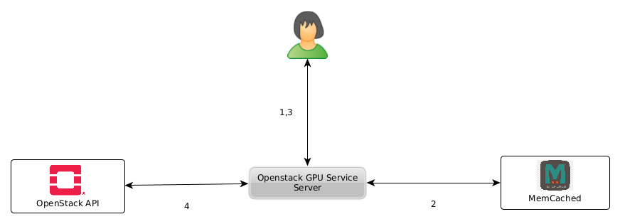

# OpenstackGPUService

## Overview

This service provides a REST-API to retrieve information about OpenStack GPU flavors (total and available). 
It is written for [de.NBI cloud](https://cloud.denbi.de) Openstack setups especially in Bielefeld, 
but can be easliy adapted to any Openstack installation providing GPU (or other) resources.

### Prerequisites
The service need some additional configurations concerning aggregates and flavors to work as expected.

#### Aggregates
Same or equal GPU based hypervisors (same GPU type, same number of GPUs) have to be summarized in a 
separate aggregate. The aggregate must make some extra metadata available:

  - **gpu='<boolean>'** Wether this aggregate provides GPU resources.
  - **gpu_count='<integer>'** Number of GPUs provided.
  - **gpu_type='<string>'** Type (**alias name**) of GPU provided.

##### Example
```
$ openstack aggregate show 'Delta GPU V100'
+-------------------+--------------------------------------------------------------------------------+
| Field             | Value                                                                          |
+-------------------+--------------------------------------------------------------------------------+
| availability_zone | default                                                                        |
| created_at        | 2018-10-13T19:08:59.000000                                                     |
| deleted_at        | None                                                                           |
| hosts             | host1,host2,...                                                                |
| id                | 10                                                                             |
| is_deleted        | False                                                                          |
| name              | Delta GPU V100                                                                 |
| properties        | cores='28', gpu='True', gpu_count='2', gpu_type='V100', hyperthreading='false' |
| updated_at        | 2022-03-23T14:31:00.000000                                                     |
| uuid              | xxxxxxxx-xxxx-xxxx-xxxx-xxxxxxxxxxxx                                           |
+-------------------+--------------------------------------------------------------------------------+
```

#### Flavors

Currently GPU are supported using the 
[PCI-passthrough feature](https://docs.openstack.org/nova/pike/admin/pci-passthrough.html)
of Openstack. Flavors must be configured setting the _pci_passthrough:alias_ property='<alias name>:<count>. The service
matches the **alias name** with aggregates gpu_type (aggregates metadata) to calculate the
total count and current available number of each flavor.

**There is of course more configuration work to do to support GPU(PCI) devices properly.**

##### Example

```
$ openstack flavor show 'de.NBI GPU V100 medium'                                                                                                                                                                                                                                    
+-------------------------------------------------------------------------------------------------+
| Field                      | Value                                                              |
+----------------------------+--------------------------------------------------------------------+
| OS-FLV-DISABLED:disabled   | False                                                              |
| OS-FLV-EXT-DATA:ephemeral  | 0                                                                  |
| access_project_ids         | ['xxx', 'xxx', 'xxx', 'xxx', ... ]                                |
| description                | None                                                               |
| disk                       | 50                                                                 |
| id                         | xxxxxxxx-xxxx-xxxx-xxxx-xxxxxxxxxxxx                               |
| name                       | de.NBI GPU V100 medium                                             |
| os-flavor-access:is_public | False                                                              |
| properties                 | pci_passthrough:alias='V100:1'                                     |
| ram                        | 65535                                                              |
| rxtx_factor                | 1.0                                                                |
| swap                       | 1024                                                               |
| vcpus                      | 14                                                                 |
+----------------------------+--------------------------------------------------------------------+

```

This server was generated by the [OpenAPI Generator](https://openapi-generator.tech) project. By using the
[OpenAPI-Spec](https://openapis.org) from a remote server, you can easily generate a server stub.

## Requirements
Python 3.6+

## Usage

It recommend to install dependencies in a separate virtual environment.

```
$ python3 -m venv venv
$ source venv/bin/activate
(venv)$ pip3 install -r requirements.txt
```

When connecting to a "real" Openstack Setup, you have to source your
RC file beforehand.  The Openstack user should be has the admin role or 
at least the capability to list all servers, flavors, hypervisor and 
aggregates.

```
(venv)$ source my_project-openrc.sh
``` 

### Client
To run the client, please execute the following from the root directory:

```
(venv)$ python3 OpenStackGPUClient.py --help
```

### Server

For performance reasons (and better user feelings) the server returns only cached
data. The cache (only memcached is supported) is updated continuously.



1. A user/client requests for data.
2. The server ask the cache if the requested resources are available.
3. Depending on the cache status, the result is returned immediately or calculated (long running task!).
4. Independent of the REST API, the cache is updated continuously (every 150 seconds by default).


To run the server, please execute the following from the root directory:

```
(venv)$ python3 OpenStackGPUServer.py 
```

When running OpenstackGPUServer without further arguments a memcached service listening on
127.0.0.1:11211 is expected and REST is bind to http://127.0.0.1:8080.

A graphical ui (for testing) is available at:

```
http://localhost:8080/ui/
```

Your OpenAPI definition lives here:

```
http://localhost:8080/openapi.json
```

##  (Units-)Test

OpenstackGPUService comes with a full set of units test. All external dependencies concerning 
the Openstack API are mocked using unittest.mock functionality.

###  Mock Test Setup
The Mock test setup "simulates" the following setup.
- two aggregates (for GPU and non GPU based hypervisors)
- three hypervisor available (28 cores, 384 cores, 4 TB local disc space), two of them having 
  two GPU on board
- two instances running (de.NBI large, de.NBI GPU V100 medium)

Calling the `gpu_flavors_get` methods should return a list of three GPU flavors.
- de.NBI GPU V100 medium (4 total, 3 available)
- de.NBI GPU V100 large (4 total, 3 available)
- de.NBI 2 GPU V100 large (2 total, 1 available)

### Integration test
To launch the integration tests, use tox from the root directory:
```
(venv)$ pip install tox
(venv)$ tox
```

## Running with Docker

To run the server on a Docker container, please execute the following from the root directory:

```bash
# building the image
docker build -t openapi_server .

# start up a container in the host network
docker run -p 8080:8080 openapi_server
docker run --network host --env-file ./env.file denbi/openstackgpuservice
```

where `env-file` contains the Openstack environment :
```
OS_REGION_NAME=Bielefeld
OS_PROJECT_DOMAIN_ID=default
OS_INTERFACE=public
OS_AUTH_URL=https://openstack.cebitec.uni-bielefeld.de:5000/v3/
OS_USERNAME=XXXX
OS_PROJECT_ID=XXXXX
OS_USER_DOMAIN_NAME=Default
OS_PROJECT_NAME=XXXXX
OS_PASSWORD=XXXXXX
```

